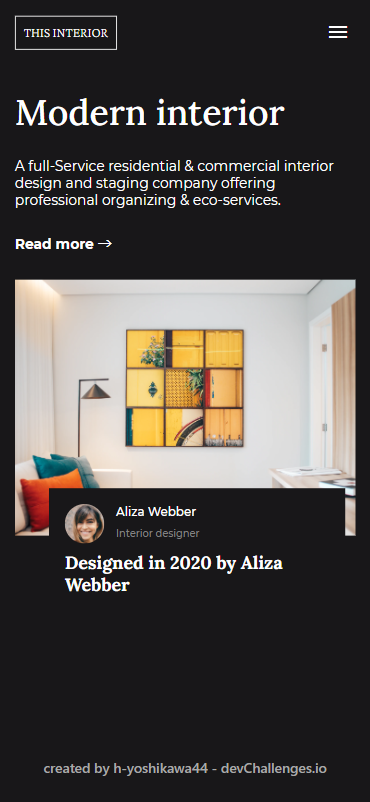
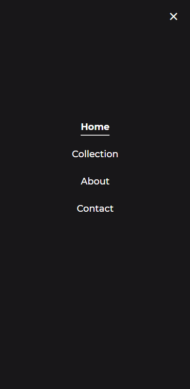

<!-- Please update value in the {}  -->

<h1 align="center">Interior Consultant</h1>

<div align="center">
   Solution for a challenge from Devchallenges.io.
</div>

<div align="center">
  <h3>
    <a href="https://h-yoshikawa44.github.io/ch-interior-consultant/">
      Demo
    </a>
  </h3>
</div>

*The site is now closed, but this assignment was originally posted at `https://legacy.devchallenges.io/solutions/N7Gs8WCVYAbtkqWxomhL`.  
（My assignment submission page at the time: `https://legacy.devchallenges.io/challenges/Jymh2b2FyebRTUljkNcb`.）

<!-- TABLE OF CONTENTS -->

## Table of Contents

- [Table of Contents](#table-of-contents)
- [Overview](#overview)
  - [Desktop](#desktop)
  - [Mobile](#mobile)
  - [Built With](#built-with)
- [Features](#features)
- [How To Use](#how-to-use)
- [learned/improved](#learnedimproved)
- [Acknowledgements](#acknowledgements)
- [Contact](#contact)

<!-- OVERVIEW -->

## Overview

### Desktop


### Mobile





### Built With

<!-- This section should list any major frameworks that you built your project using. Here are a few examples.-->

Base
- [HTML](https://developer.mozilla.org/ja/docs/Web/HTML)
- [CSS](https://developer.mozilla.org/ja/docs/Web/CSS)
- [JavaScript](https://developer.mozilla.org/ja/docs/Web/JavaScript)
- [Node.js](https://nodejs.org/)：22.13.1
- [Vite](https://ja.vitejs.dev/)：6.1.0

Other major libraries
- [postcss-preset-env](https://github.com/csstools/postcss-plugins/tree/main/plugin-packs/postcss-preset-env)
- [material-design-icons](https://google.github.io/material-design-icons/)
- [wicg-inert](https://github.com/WICG/inert)

## Features

<!-- List the features of your application or follow the template. Don't share the figma file here :) -->

This application/site was created as a submission to a DevChallenges challenge. The challenge was to build an application to complete the given user stories.

- [x] User story: I can see a page following the given design
- [x] User story: On mobile, I can see a collapsed navigation
- [x] User story: On mobile, when I select the hamburger menu, I can see a navigation

## How To Use
To clone and run this application, you'll need [Git](https://git-scm.com/) and [Node.js](https://nodejs.org/en/download/) (which comes with [npm](https://www.npmjs.com/)) installed on your computer. From your command line:

```bash
# Clone this repository
git clone https://github.com/h-yoshikawa44/ch-interior-consultant.git
or
git clone git@github.com:h-yoshikawa44/ch-interior-consultant.git

# Install dependencies
npm install

# Run the Vite
npm run dev
```

## learned/improved

- basic usage of Vite.
- Using Vite and the VSCode extension Autoprefixer together causes conflicts and hot reloading problems.
- How to animate underline on hover.

## Acknowledgements

<!-- This section should list any articles or add-ons/plugins that helps you to complete the project. This is optional but it will help you in the future. For exmpale -->

- [jQueryからTypeScript・Reactまで！Viteで始めるモダンで高速な開発環境構築](https://ics.media/entry/210708/)
- [Webエンジニア（コーダー）向けVite環境の紹介【初心者向け解説】](https://flex-box.net/vite-for-coder/)
- [CSS：ホバー時のアンダーラインアニメーションの実装サンプルとmixinを用いた実装方法](https://www.nxworld.net/css-hover-underline-animation-examples-and-sass-mixin.html)
- [GitHub Actionsのworkflow_runイベントでテストを回すときの要点](https://blog.kengo-toda.jp/entry/2021/07/06/222400)

## Contact

- Website：[h-yoshikawa44.com](https://h-yoshikawa44.com)
- GitHub：[@h-yoshikawa44](https://github.com/h-yoshikawa44)
- X：[@yoshi44_lion](https://x.com/yoshi44_lion)
